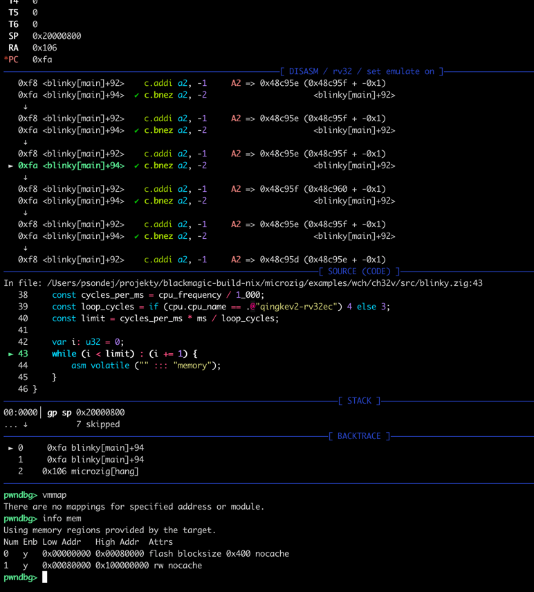
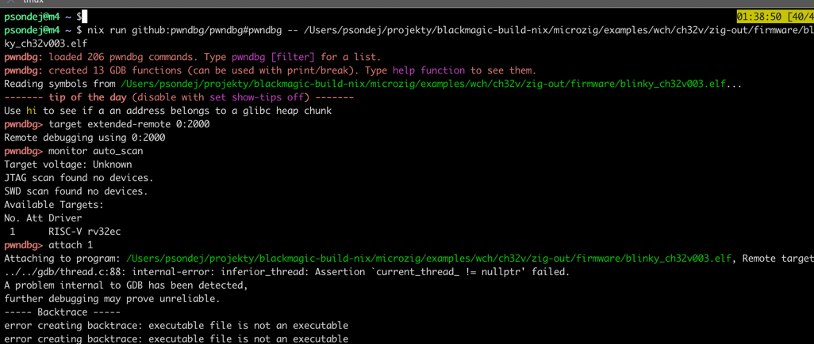
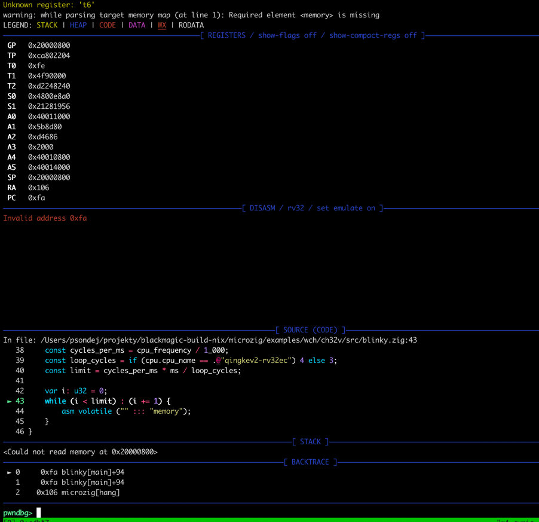

This should work on *Linux* and *MacOS*.

Tested only on: WCH-LinkE + CH32V003 + MacOS

### openocd
```
nix run github:patryk4815/ch32v-nix#openocd -- \
    -c "adapter_khz 2000" \
    -c "adapter driver wlinke" \
    -f target/wch-riscv.cfg \
    -c "program main.elf verify reset exit"
```

### blackmagic
```
nix run github:patryk4815/ch32v-nix#blackmagic
```

### Attached CH32V003 (WCH-LinkE + openocd + pwndbg)


### Attached CH32V003 (WCH-LinkE + blackmagic + pwndbg)
> Known issues:
> - memory reading don't work
> - gdb is crashing on `attach 1` (workaround - `target remote 0:2000` again into blackmagic)




